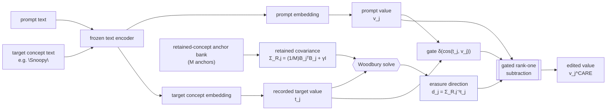

<div align="center">

# CARE
### *Erasing Without Collateral Damage: Precise Concept Removal in Diffusion Models*

[](LICENSE)
[](requirements.txt)

</div>

---

## Overview

Training-free concept erasure edits a diffusion model's cross-attention value space to
remove a target concept for example, an artist's style, a fictional character, a public figure etc
while leaving the rest of the model's generative prior intact. The difficulty is not
erasing the target; it's erasing it *without* damaging semantically related concepts
that should be kept. Prior value-space methods erase along the raw recorded target
direction, which mixes the target's distinctive identity with visual structure it
shares with concepts that should survive the edit, removing that direction removes
both.

**CARE** replaces the raw target direction with a **kept-subspace-aware direction**,
computed offline from a small bank of retained-concept anchors. For each target concept
and cross-attention token position `j`, a bank of `M` retained-concept value vectors
`B_j` gives a retained-anchor covariance:

$$\Sigma_{R,j} = \frac{1}{M} B_j^\top B_j + \gamma I_D \qquad\qquad d_j = \Sigma_{R,j}^{-1} t_j$$

`d_j` down-weights components of the target `t_j` that lie along high-variance
*retained* directions, while emphasizing the components that distinguish the target from
what should be kept. The erasure itself is a gated rank-one value subtraction, with `d_j`
in place of the raw target direction:

$$v_j^{\text{CARE}} = v_j - \delta\big(\cos(t_j, v_j)\big)\, \frac{\langle d_j, v_j\rangle}{\langle d_j, d_j\rangle}\, d_j$$

The `M×M` inverse is computed in closed form via the Woodbury identity (`M ≪ D`), so the
only added cost is a negligible offline solve (~1.2s) plus ~0.7% per-image generation
overhead.



A single shrinkage parameter `γ` exposes the erase–preserve trade-off directly:

| Regime | Behavior |
|---|---|
| `γ → ∞` | covariance term vanishes → recovers plain value-space erasure **exactly** |
| finite `γ` (deployed) | whitened erasure direction; the trade-off is calibrated per concept (see the ablation, `results/SCOREBOARD.md` Table 6) |
| projection form (`t_j⊥ = (I − R_jR_jᵀ)t_j`) | **exact** kept-subspace invariance: any value already in the retained subspace is left unchanged |

## Getting started

### 01. Setup

```bash
conda create -n care -y python=3.9
conda activate care
pip install -r requirements.txt
```

`src/care.py` clones the upstream diffusion pipeline it patches automatically on first
run (`git clone --depth=1 https://github.com/WYuan1001/AdaVD`) and drives it through
`sys.path`; no manual setup beyond having git and network access on first run. See
[Implementation](#implementation) below for why.

### 02. Reproducing a single cell

Every run is configured with two environment variables `ITER_ID` (an output-folder
name) and `ADAVD_CFG` (a JSON config: `erase_type`, `targets`, `nontargets`, `anchors`,
`ns`, `rank`, `op`, `gamma`). This is the exact configuration that produced
[`results/instance/snoopy.json`](results/instance/snoopy.json):

```bash
export C43A_HOME=$(pwd)/.run
export ITER_ID=snoopy
export ADAVD_CFG='{
  "erase_type": "instance",
  "targets":    ["Snoopy"],
  "nontargets": ["Mickey Mouse", "SpongeBob", "Pikachu", "Dog", "Legislator"],
  "anchors":    ["Bugs Bunny", "Hello Kitty", "Garfield", "Tom and Jerry", "Donald Duck", "Popeye"],
  "ns": 10, "rank": 1, "op": "whitened", "gamma": 0.5
}'
python src/care.py
# → writes $C43A_HOME/outputs/snoopy/{results.json, report.json, run_log.txt}
```

Set `"op": "whitened"` for CARE, or take `γ → ∞` (in practice, a very large `gamma`) for
the `γ → ∞` limiting case in the table above, through the same code path.

### 03. Reproducing the full table

`scripts/run_main_experiments.py` holds the exact `QUEUE` of all 9 published cells
(instance / style / celebrity, single- and multi-concept) with their per-concept `γ`
(separable concepts `0.2`, entangled concepts `0.5`) and disjoint anchor/probe sets,
invoking `src/care.py` once per cell:

```bash
export C43A_HOME=$(pwd)/.run
python scripts/run_main_experiments.py
```

The script optionally uploads each cell's `report.json` to a Hugging Face dataset repo
as it completes set `HF_TOKEN` (and optionally `C43A_HF_REPO`) to enable this; it is
skipped entirely otherwise, so the script runs unmodified on a single local GPU with no
Hugging Face account required. Expect several GPU-hours for the full 9-cell sweep at
`ns=10` with all benchmark templates.

## Results

Evaluated under the standard concept-erasure protocol (SD-1.4, DPM-Solver, 30 steps, CFG
7.5, CLIP score for erasure, FID for preservation) across instance, art-style, and
celebrity concept erasure. Full tables (paper Tables 1, 3–6) are in
**[`results/SCOREBOARD.md`](results/SCOREBOARD.md)**:

| Setting | Target CS↓ (before → after CARE) | Retained-concept FID↓ |
|---|---|---|
| Erase Snoopy (single) | 20.28 → **19.42** | improves on **all 5** retained probes |
| Erase Van Gogh (style) | 24.87 → **23.63** | improves on 3/4 retained styles |
| Erase Picasso (style) | 26.99 → 26.99 (tie) | improves on **all 4** retained styles |
| Erase Monet (style) | 26.30 → **24.58** | improves on **all 4** retained styles |
| Erase Bruce Lee (celeb) | 20.67 → **18.42** | improves on **all 4** retained identities |
| Erase Marilyn Monroe (celeb) | 19.87 → **17.73** | improves on **all 4** retained identities |
| Erase Melania Trump (celeb) | 23.28 → **21.90** | improves on 3/4 retained identities |


## Repository structure

```
care/
├── src/
│   └── care.py                    # CARE kernel: whitened erasure direction + eval harness
├── scripts/
│   └── run_main_experiments.py    # runner: queues the 9 erase cells with per-concept γ
├── results/
│   ├── instance/                  # Snoopy, Snoopy+Mickey, Snoopy+Mickey+SpongeBob
│   ├── style/                     # Van Gogh, Picasso, Monet
│   ├── celebrity/                 # Bruce Lee, Marilyn Monroe, Melania Trump
│   └── SCOREBOARD.md              # full paper tables (1, 3–6)
├── requirements.txt
└── LICENSE                        # Apache 2.0
```

## Implementation

CARE is a training-time-free edit to a frozen diffusion model's cross-attention value
space; it does not touch the UNet, text encoder, or any cross-attention projection
weights. It's implemented as a small patch a single function,
`AttnProcessor.cal_ortho_decomp` over an existing value-space erasure codebase
([AdaVD](https://github.com/WYuan1001/AdaVD), Wang et al., CVPR 2025), which supplies
the diffusion pipeline, cross-attention value-recording hooks, and the concept-erasure
benchmark templates used to produce the results above. Everything outside that one
function is that codebase's unmodified evaluation infrastructure.

## Citation

A citation will be added here once the paper is published.

## License

Apache License 2.0 see [`LICENSE`](LICENSE).

## Acknowledgement

We thank the authors of AdaVD for their code.
